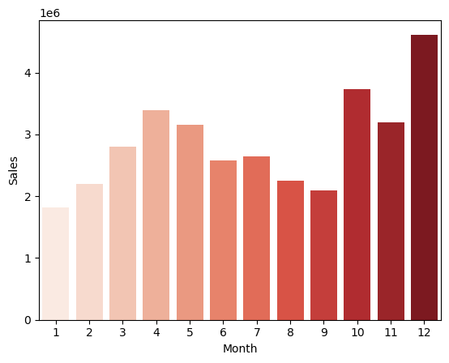
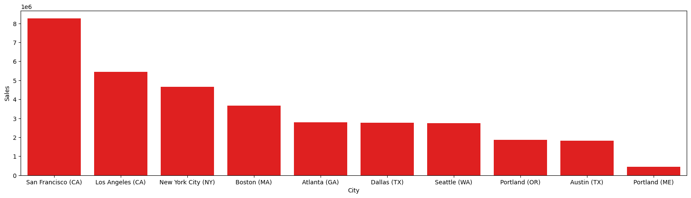
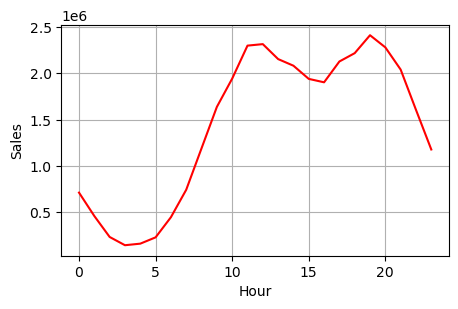
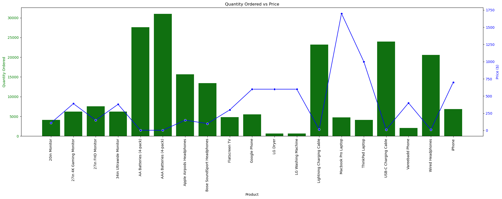
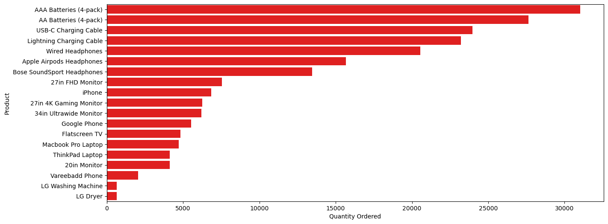

# E-Commerce Sales Performance & Consumer Behavior Analysis
# 📌 Project Overview
This repository contains an end-to-end Python data analysis project focused on cleaning, engineering, and exploring a 12-month electronics retail dataset. The project transitions raw, fragmented monthly transactional data into an optimized master dataset to extract key business intelligence insights regarding seasonal trends, regional demand, advertising schedules, and cross-selling product bundles.

# Situation
A retail company had 12 separate monthly sales CSV files containing over 186,000 transaction records. The data was spread across multiple files and contained missing values, inconsistent data types, and duplicate records, making it difficult to analyze sales performance and customer purchasing behavior.

# Task
My objective was to:

- Consolidate all monthly datasets into a single clean dataset.
- Clean and preprocess the data.
- Analyze sales performance.
- Identify business trends and provide actionable insights to support business decisions.

# Action
1. Data Consolidation & Merging
Automated the pipeline to loop through 12 individual monthly .csv sales files.

Dynamically filtered out system-hidden files and concatenated 186,850 rows of transactional data into a unified database (all_data_copy.csv).

2. Data Cleaning & Wrangling
Identifed and dropped 545 null rows to maintain structural integrity.

Resolved data anomalies by filtering out row errors where duplicated text headers were inserted into data lines.

Fixed explicit structural data types, converting Month to categorical integers, and text fields like Quantity Ordered and Price Each into precise numeric floating points.

3. Feature Engineering
Formulated a key Sales metric by multiplying the volume ordered by individual unit prices to calculate localized revenue performance per transaction.

Extracted hidden temporal markers (Hour, Month) from standard date strings to evaluate chronological buying patterns.

# 📈 Core Business Questions Answered
## *- What was the best month for sales?* 
Analyzed seasonal revenue fluctuations, identifying December as the peak period with ~4.61M in revenue, heavily driven by holiday demand.

## *- Which city achieved the highest sales volume?*
Mapped geographical data to prove San Francisco (CA) completely dominates sales with over 8.2M in volume, indicating a primary strategic market hub.

## - *What is the optimal time to display advertisements?* 
Plotted dynamic hourly consumer purchasing peaks to find two dominant daily traffic windows: 11:00 AM–12:00 PM and 7:00 PM.

## *- What products are most frequently sold together?* 
Performed duplicate order association grouping, revealing that iPhones paired with Lightning Cables and Google Phones paired with USB-C Cables are the highest-performing companion item bundles.

## *- How do product price metrics correlate to overall units sold?* 
Built a dual-axis overlay visualization proving the inverse correlation between premium high-ticket revenue drivers (e.g., MacBooks) and high-volume, low-cost utility drivers (e.g., AAA batteries).

## *- What product sold the most? Why do you think it sold the most?*
The product that sold the absolute most is AAA Batteries (4-pack), leading the chart
Because Batteries are exceptionally cheap compared to electronics like smartphones or laptops. Because the financial barrier to entry is practically nonexistent, consumers buy them frequently and in large quantities without hesitation.
AAA batteries are everyday consumable items. They power a massive array of household goods—tv remotes, wireless mice, keyboards, toys, and clocks. Unlike a phone or a laptop (which a customer buys once every few years), batteries run out of juice and constantly need to be replaced, driving high-volume, repetitive sales.

# 🛠️ Tech Stack & Libraries
Language: Python

Data Wrangling: Pandas, NumPy

Data Visualization: Matplotlib, Seaborn

# Author
*Riya Bhatt*
# LinkedIN 
*https://www.linkedin.com/in/riyabhattz/*
